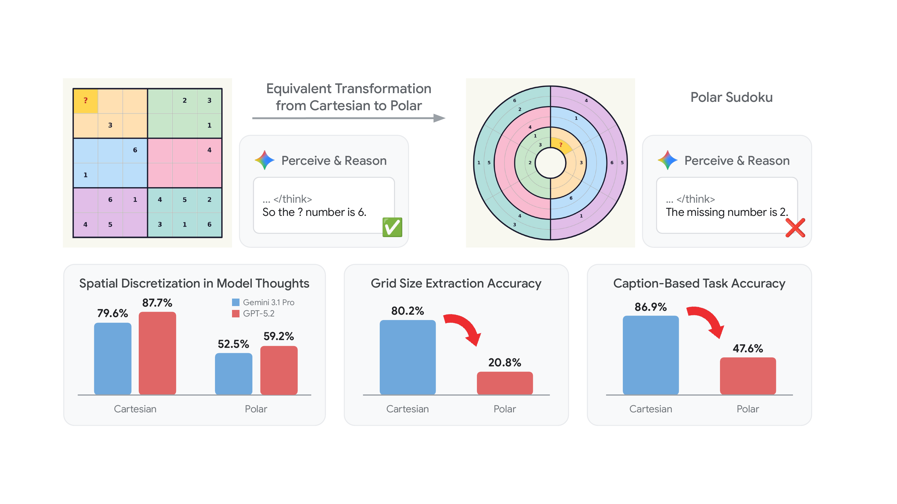
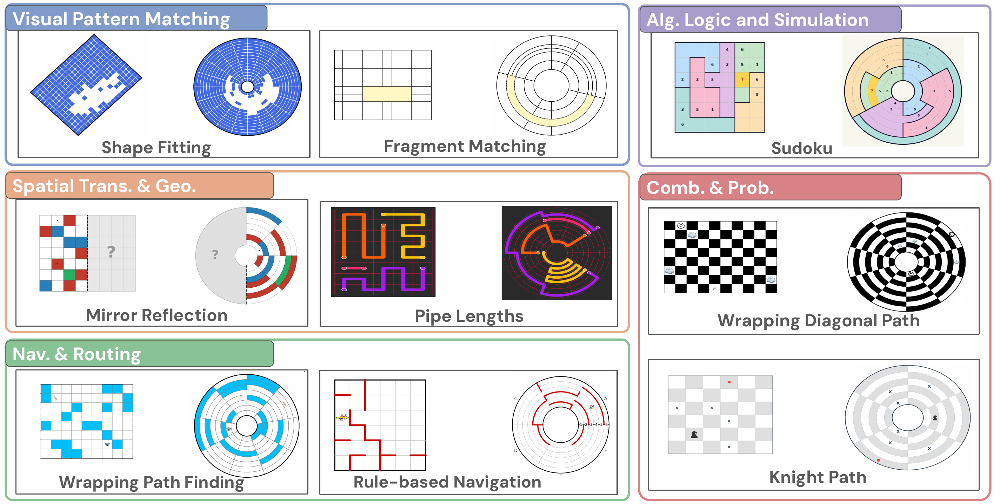

<h1 align="center">The Cartesian Shortcut: Re-evaluate Vision Reasoning in Polar Coordinate Space</h1>

<p align="center">
  <strong>Polaris-Bench: Official Benchmark and Evaluation Suite</strong>
</p>

<p align="center">
  <a href="https://arxiv.org/abs/2605.09883"></a>
  <a href="https://huggingface.co/datasets/google/polaris-bench"></a>
  <a href="https://google-deepmind.github.io/polaris-bench"></a>
  <a href="LICENSE"></a>
  <a href="https://creativecommons.org/licenses/by/4.0/legalcode"></a>
</p>

<p align="center">
  <a href="https://scholar.google.com/citations?user=1PT3EQoAAAAJ">Xia Hu</a><sup>1</sup>, 
  <a href="https://scholar.google.com/citations?user=9Iy_KmsAAAAJ">Zhenrui Yue</a><sup>1</sup>, 
  <a href="https://scholar.google.com/citations?user=OwEFVw4AAAAJ">Brian Potetz</a><sup>1</sup>, 
  <a href="https://scholar.google.com/citations?user=dJXeYCoAAAAJ">Howard Zhou</a><sup>1</sup>, 
  <a href="https://scholar.google.com/citations?user=5JlEyTAAAAAJ">Leonidas Guibas</a><sup>1,2</sup>, 
  <a href="https://scholar.google.com/citations?user=05CGvyAAAAAJ">Chun-Ta Lu</a><sup>3</sup>, 
  <a href="https://scholar.google.com/citations?user=2ccN2csAAAAJ">Zhicheng Wang</a><sup>1</sup>
  <br>
  <sup>1</sup>Google DeepMind &nbsp; <sup>2</sup>Stanford University &nbsp; <sup>3</sup>Google Research
</p>

---

## Overview

Current Multimodal Large Language Models (MLLMs) achieve strong performance on visual reasoning benchmarks, but do these scores reflect genuine visual perception? In this work, we identify a pervasive vulnerability: **the Cartesian Shortcut**.

### The Cartesian Shortcut
<p align="center">
  
</p>


Standard visual reasoning benchmarks are predominantly structured around orthogonal, grid-based Cartesian layouts. We find that state-of-the-art models systematically exploit this structure: rather than performing true visual-spatial reasoning, they discretize 2D images into explicit textual coordinates (such as row and column indices) and offload spatial deduction onto pure text-based reasoning. This text-based shortcut inflates benchmark scores while masking critical deficiencies in genuine visual understanding.

### Polaris-Bench

To dismantle the Cartesian Shortcut, we introduce **Polaris-Bench**, an evaluation benchmark that re-formulates 53 visual reasoning tasks across 5 cognitive categories into **Polar coordinate space**, paired directly with their Cartesian counterparts under identical logical constraints and rules. In Polar space, lines of constant coordinate curvature bend, distance metrics depend on radius, and coordinate discretization becomes non-trivial.

Under this controlled setting, frontier models that achieve 70-83% accuracy on Cartesian layouts experience a dramatic performance collapse to 31-39% on logically equivalent Polar tasks, while human performance remains robust (94.5% Cartesian vs. 88.8% Polar).


<p align="center">
  
</p>

## Leaderboard

All models evaluated under high reasoning mode. Sorted by **Polar accuracy (P)**. Full per-category results on the [project page](https://google-deepmind.github.io/polaris-bench).

| # | Model | Type | Cartesian (%) | Polar (%) | Drop (Δ) |
|:-:|-------|:----:|:---:|:---:|:---:|
| 👤 | **Human** | Baseline | **94.5** | **88.8** | **-5.7** |
| 1 | **GPT-5.2** | Closed | 77.4 | **39.2** | -38.2 |
| 2 | **Gemini-3.1-Pro** | Closed | **82.6** | 35.9 | -46.7 |
| 3 | **Qwen3.5-397B-A17B** | Open | 72.9 | 35.0 | -37.9 |
| 4 | **Gemini-3-Flash** | Closed | 71.0 | 33.8 | -37.2 |
| 5 | **Kimi-k2.5** | Open | 69.0 | 31.1 | -37.8 |
| 6 | **Gemma-4-31B** | Open | 60.5 | 31.0 | -29.5 |
| 7 | **Claude-Sonnet-4.6** | Closed | 44.4 | 25.9 | -18.5 |
| 8 | **Gemini-2.5-Pro** | Closed | 38.4 | 25.3 | -13.2 |
| 9 | **Gemini-3.1-Flash-Lite** | Closed | 46.8 | 24.6 | -22.2 |
| 10 | **Gemma-4-26B** | Open | 47.2 | 22.9 | -24.4 |
| 11 | **Grok-4-Fast-Reasoning** | Closed | 31.0 | 22.3 | -8.7 |
| 12 | **Grok-4-0709** | Closed | 33.0 | 21.8 | -11.2 |
| 13 | **Gemini-2.5-Flash** | Closed | 32.2 | 21.1 | -11.2 |
| 14 | **Mistral-Small-2503** | Open | 19.4 | 19.0 | -0.4 |
| - | **Random Baseline** | Baseline | 15.8 | 15.8 | 0.0 |

## Dataset on Hugging Face

The complete Polaris-Bench evaluation dataset (all 10,800 multimodal problem instances across 53 tasks and 4 coordinate systems) is hosted on the Hugging Face Hub:

**[https://huggingface.co/datasets/google/polaris-bench](https://huggingface.co/datasets/google/polaris-bench)**

You can load the full dataset directly using the Hugging Face `datasets` library:

```python
from datasets import load_dataset

# Load the full 10,800 evaluation problem instances
dataset = load_dataset("google/polaris-bench", split="test")

# Inspect an example
sample = dataset[0]
print(f"Task: {sample['task']} | Coordinate System: {sample['question_type']}")
print(f"Question: {sample['question']}")
print(f"Answer: {sample['answer']}")
# sample["image"] is automatically decoded as a PIL Image object
```

> **Offline sample tasks**: If you want to explore the benchmark locally without downloading the full Hugging Face image dataset, a standalone set of 20 representative paired Cartesian-Polar tasks is included directly in this repository under [`examples/sample_tasks/`](examples/sample_tasks/).

## Repository Structure

```
polaris-bench/
├── evaluation/              # Core evaluation module and benchmark scoring
│   ├── __init__.py          # Package exports (PolarisDataLoader, Evaluator)
│   ├── data_loader.py       # Dataset loader (supports Hugging Face, local JSON, and sample tasks)
│   └── evaluate.py          # Benchmark evaluation script (accuracy by coordinate system and category)
├── examples/                # Quick start guide and local offline sample instances
│   ├── quick_start.py       # Standalone demo script (loads data, paired tasks, and runs mock evaluation)
│   └── sample_tasks/        # 20 representative paired tasks for local offline inspection
│       ├── sample_tasks.json# Paired Cartesian vs. Polar questions and ground truth
│       ├── README.md        # Documentation for sample tasks
│       └── images/          # PNG images organized by task
├── docs/                    # Project webpage source (served via GitHub Pages)
│   ├── index.html           # Interactive project page with leaderboard and task viewer
│   └── static/              # Paper figures, teasers, and website assets
├── tests/                   # Unit test suite
│   └── test_benchmark.py    # 9 automated tests for data loading, matching, and metrics
├── pyproject.toml           # Python package build configuration
├── requirements.txt         # Minimal dependencies (datasets, Pillow, etc.)
├── LICENSE                  # Apache 2.0 license
└── README.md                # Project documentation and getting started guide
```

## Installation

```bash
git clone https://github.com/google-deepmind/polaris-bench.git
cd polaris-bench
pip install -r requirements.txt
```

## Quick Start

You can inspect the benchmark using either the HuggingFace Hub dataset or the local offline sample data:

```python
from evaluation.data_loader import PolarisDataLoader

# 1. Load from local file or HuggingFace Hub ('google/polaris-bench')
loader = PolarisDataLoader("examples/sample_tasks/sample_tasks.json")

# 2. Filter by task and coordinate system
cart_examples = loader.get_dataset(task="sudoku", question_type="cartesian")
print(f"Loaded {len(cart_examples)} Cartesian Sudoku tasks.")

# 3. Retrieve paired instances (Cartesian vs. Polar)
pairs = loader.get_paired_dataset(task="sudoku")
cart_sample, polar_sample = pairs[0]

print("Cartesian Image:", cart_sample["image_path"])
print("Polar Image:    ", polar_sample["image_path"])
print("Ground Truth:   ", cart_sample["answer"])
```

> **Offline sample data**: A standalone set of 20 representative paired tasks is provided in [`examples/sample_tasks/`](examples/sample_tasks/) for quick local inspection without downloading the full dataset.

## Evaluation

Evaluating a model on Polaris-Bench consists of two simple steps: **model inference** and **benchmark scoring**.

### Step 1: Generate Predictions from Your Model

Query your multimodal model (e.g. Gemini, GPT, Claude, or local open-weights) with each task's image and question prompt. Collect the outputs into a predictions JSON file:

```python
import json
from evaluation.data_loader import PolarisDataLoader

loader = PolarisDataLoader("examples/sample_tasks/sample_tasks.json")

# Run inference with your model and save predictions
predictions = {}
for example in loader:
    key = f"{example['task']}::{example['index']}::{example['question_type']}"
    # Call your model inference function here:
    # predictions[key] = your_model.generate(image=example['image'], prompt=example['question'])
    predictions[key] = "A"

with open("predictions.json", "w") as f:
    json.dump(predictions, f, indent=2)
```

**Supported Prediction Formats**:

1. **3-part key** (`task::index::question_type`):
```json
{
  "sudoku::example_001::cartesian": "D",
  "sudoku::example_001::polar": "B",
  "maze::example_042::polar": "A"
}
```

2. **Nested by coordinate system**:
```json
{
  "cartesian": {
    "sudoku::example_001": "D"
  },
  "polar": {
    "sudoku::example_001": "B"
  }
}
```

3. **List of prediction records**:
```json
[
  {
    "task": "sudoku",
    "index": "example_001",
    "question_type": "polar",
    "prediction": "B"
  }
]
```

### Step 2: Score Predictions Against Ground Truth

Run the evaluation script to compute accuracy metrics and the Cartesian-to-Polar drop:

```bash
python -m evaluation.evaluate \
  --predictions predictions.json \
  --ground-truth polaris_bench.json
```

To evaluate only a specific coordinate system, pass `--question-type`:
```bash
python -m evaluation.evaluate \
  --predictions predictions.json \
  --question-type polar
```

The script displays a formatted terminal summary table and exports a detailed JSON report (`evaluation_report.json`), illustrated below on GPT-5.2 evaluation results:
```
==================================================================================
                         POLARIS-BENCH EVALUATION REPORT
==================================================================================
Total Evaluated: 10600 | Overall Accuracy: 58.3%
Cartesian Acc:   77.4% | Polar Acc: 39.2% | Drop (Cartesian - Polar): 38.2 pt
----------------------------------------------------------------------------------
Category                             | Cartesian (%) | Polar (%)  | Drop (pt) 
----------------------------------------------------------------------------------
Algorithmic Logic & Simulation       | 70.7          | 46.7       | 24.0      
Combinatorics & Probability          | 84.8          | 30.7       | 54.1      
Navigation & Routing                 | 82.2          | 42.8       | 39.4      
Spatial Transformation & Geometry    | 76.5          | 41.6       | 34.9      
Visual Pattern Matching              | 70.0          | 34.5       | 35.5      
==================================================================================
```

## Dataset Structure

Each record contains 6 fields (+ `image` in the HuggingFace Parquet version):

| Field | Type | Description |
|-------|------|-------------|
| `task` | string | Task name (e.g., `sudoku`, `maze`, `shape_fitting`) |
| `index` | string | Sample index (e.g., `example_001`) |
| `question_type` | string | `cartesian`, `polar`, `hexagonal`, or `octagonal` |
| `image` | PIL.Image | Evaluation image (RGBA, ~3000×3000 to 4000×3600) |
| `image_path` | string | Relative path (e.g., `images/sudoku/sudoku_example_001_cartesian.png`) |
| `question` | string | Evaluation question text |
| `answer` | string | Ground-truth answer (option labels, digits, coordinates, strings, or lists) |

## Task Taxonomy

53 tasks organized into 5 cognitive categories:

| Category | Tasks | Count |
|----------|-------|:-----:|
| **Visual Pattern Matching** | pattern_completion, pattern_prediction, layer_completion, shape_completion, shape_fitting, jigsaw_matching, odd_piece_out, fragment_matching, anomaly_detection, template_matching, impossible_shape | 11 |
| **Spatial Transformation & Geometry** | grid_rotation, pivot_rotation, mirror_reflection, grid_folding, rotation_center, rotation_matching, area_balancing, minimum_flips, wall_follower, letter_collection, turn_counting, pipe_lengths, word_search | 13 |
| **Navigation & Routing** | maze, shortest_path, bounded_path_finding, wrapping_path_finding, bounded_diagonal_paths, wrapping_diagonal_paths, bounded_knight_paths, knight_paths, checkpoint_paths, monotonic_path, rule_based_navigation, absolute_navigation, egocentric_navigation, wrapping_navigation | 14 |
| **Combinatorics & Probability** | path_counting, lattice_paths, area_counting, edge_counting, uncut_cells, maximum_collection, longest_path, largest_number_path, curve_length | 9 |
| **Algorithmic Logic & Simulation** | sudoku, four_color, n_queens, random_walk, collision_detection, bouncing_point | 6 |

## Citation

```bibtex
@misc{hu2026cartesianshortcutreevaluatevision,
  title         = {The Cartesian Shortcut: Re-evaluate Vision Reasoning in Polar Coordinate Space},
  author        = {Xia Hu and Zhenrui Yue and Brian Potetz and Howard Zhou and Leonidas Guibas and Chun-Ta Lu and Zhicheng Wang},
  year          = {2026},
  eprint        = {2605.09883},
  archivePrefix = {arXiv},
  primaryClass  = {cs.CV},
  url           = {https://arxiv.org/abs/2605.09883}
}
```

## Licensing & Disclaimer

Copyright 2026 Google LLC

All software is licensed under the Apache License, Version 2.0 (Apache 2.0); you may not use this file except in compliance with the Apache 2.0 license. You may obtain a copy of the Apache 2.0 license at: https://www.apache.org/licenses/LICENSE-2.0

All other materials are licensed under the Creative Commons Attribution 4.0 International License (CC-BY). You may obtain a copy of the CC-BY license at: https://creativecommons.org/licenses/by/4.0/legalcode

Some data was created with inspiration from:
- Babyvision, which is available at https://github.com/UniPat-AI/BabyVision under the Creative Commons Attribution 4.0 International License (CC-BY). You may obtain a copy of the CC-BY license at: https://creativecommons.org/licenses/by/4.0/legalcode.
- EMMA-Bench, which is available at https://github.com/EMMA-Bench/EMMA.
- MathVista: https://github.com/lupantech/MathVista (released under the Creative Commons Attribution-ShareAlike 4.0 International License, CC BY-SA 4.0).
- MEGABench: https://github.com/TIGER-AI-Lab/MEGA-Bench.


Unless required by applicable law or agreed to in writing, all software and materials distributed here under the Apache 2.0 or CC-BY licenses are distributed on an "AS IS" BASIS, WITHOUT WARRANTIES OR CONDITIONS OF ANY KIND, either express or implied. See the licenses for the specific language governing permissions and limitations under those licenses.

This is not an official Google product.


